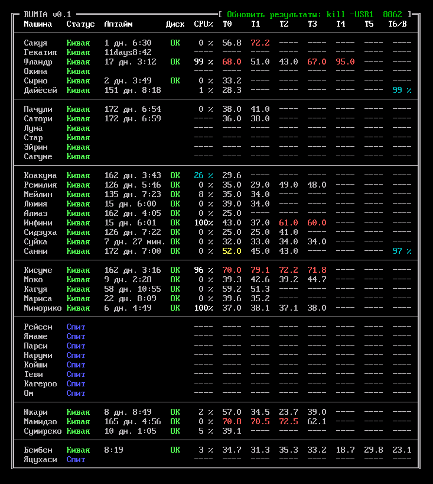

# rumia

RUMIA - Remote Unit MonItoring Application



## Purpose

This is a little but extensible, handy cross-platform BASH script that may be
used, at the moment, to monitor several stuff (availability, uptime, disk
consistency, CPU/HDD temperatures, battery charge level) on several remote
computers using only the text console (either computer screen or ssh session),
without a requirement of any compiler or build system (and also without ability
of doing this through SNMP, IPMI or HTTP/HTTPS, but you should rethink your life
if you are up to do it with plain `bash` + `coreutils` and virtually nothing
more).

Additionally, it contains another script that can execute arbitrary command on
the chosen remote computers.

## Requirements

* bash
* coreutils
* ssh
* an ANSI-compatible UTF-8 console (e.g. putty/xterm)
* anything you specify in `require` file for certain computer(s)

## Configuration

### Configuring RUMIA itself

You should prepare a config file (see `rumia.conf.example` as an example)
as following:

* `PREFIX` should be a path where RUMIA is installed. It should contain language
files, and, in typical installation, `computers.d` and `templates.d` dirs.

* `COMPUTERS_D` should be a path to `computers.d` directory. May be relative
to `PREFIX` if BASH variable substitution is used.

* `LOGFILE` should be a path to log file which will be appended with a complete
information assembled during each shot. May be relative to `PREFIX` if BASH
variable substitution is used.

* `RUMIA_LANG` should be set according to a desired language. Currently
available languages are `en_US` and `ru_RU`. The corresponding
`language.$RUMIA_LANG` file must exist in `$PREFIX`.

* `DELAY` should be set to a seconds between end of one shot and begin of the
following (Note: it's not the time between start of each shot, so actual period
time is equal to time consumed by one shot and this delay).

All variables are set using generic BASH syntax, e.g. no spaces should be
between variable name, "=" sign, and variable value; values containing
spaces must be enclosed in double or single quotes; BASH variable substitutions
are allowed, etc.

In the example of `rumia.conf`, any of these variables may be redefined while
starting `rumia`. For example, if RUMIA is configured to use Russian language,
but you want to launch it in one shot mode with English output, you may run:

```bash
RUMIA_LANG=en_US ./rumia --oneshot
```

Unless `--config` specified in command line, RUMIA reads the following files
as its config files (if any of them exist):

* `/etc/rumia.conf`: system-wide RUMIA config file
* `~/.config/rumia.conf`: user-specific RUMIA config file
* `~/.rumiarc`: user-specific additions to RUMIA config file
* `./rumia.conf`: directory-specific RUMIA config file

Each next file take precedence over the previous ones (overriding the
definitions made in it).

### Letting RUMIA know about remote computers

For each monitored computer, a specific subdirectory should be made inside
`computers.d` directory (there are various examples of it inside
`computers.d.example` subdirectory of RUMIA). This directory may contain
the following files or symbolic links:

* Marker files. These files are generally zero-sized and made by `touch`
command, and removed by `rm` (obviously).

    * `ssh_enabled`: Let RUMIA poll this computer at all. Every computer that
    does not have this marker is skipped while gathering information.

    * `temp_enabled`: Let RUMIA check temperatures for a specified computer.
    Makes no sense if `ssh_enabled` doesn't exist.

    * `absent`: Let RUMIA know that this computer is intentionally absent. If
    it can't be reached by `ping_cmd`, it produces "Sleep" message in the table
    instead of "Dead", so it could be considered not a failure that needs
    attention. Makes no sense if `ssh_enabled` doesn't exist.

    * other `*_enabled` files: useful when running `execute_cmd` (see below).

* Data files. These files are generally symlinks to data files inside
`templates.d` subdirectory, except when a file is supposed to be unique (e.g.
SSH private key or computer's fancy name).

    * `key`: private SSH key to use while connecting to computer. To
    successfully connect to computer, you must have public key of specified
    user in his/her `authorized_keys` file, and host fingerprint in
    `known_hosts` on the host where you run RUMIA. For latter one, you could
    just connect once from host where you run RUMIA, to the desired computer,
    and accept the certificate.

    * `fancyname`: a fancy name for a computer that may be used instead of its
    hostname in the table (unless `--nofancynames` is specified, or this file
    doesn't exist). For example, it may be a short form of hostname (e.g.
    "div193-host195.organization.com" could have a fancy name of "Host 195");
    or it could be a beautifized name using symbols that are not allowed in
    a typical hostname (e.g. host "twilight-sparkle" may have fancy name of
    "Твайлайт" in Russian language). Makes no sense if `ssh_enabled` doesn't
    exist. If fancy name or hostname (when fancy name is not used) is longer
    than 8 characters, it will be truncated.

    * `temp_nodes`: Number of temperatures that are readable from a computer.
    If missing, no temperature or battery level check is performed. Usually it
    is a symlink to `../../templates.d/nodes.*` file which contains the desired
    number. Has no effect if `temp_enabled` is missing.

    * `temp_alert`: Alerting temperature value. Temperatures lower that that
    are shown in gray, higher (but below critical) are shown in yellow. Has
    no effect if `temp_enabled` is missing. Usually it is a symlink to
    `../../templates.d/temp_alert.*` file which contains the desired
    temperature.

    * `temp_crit`: As above, but a critical temperature value. Temperatures
    higher that that are shown in red. Has no effect if `temp_enabled`
    is missing. Usually it is a symlink to `../../templates.d/temp_crit.*` file
    which contains the desired temperature.

    * `require`: A list of binaries (one for a line) which is to be checked
    for existence on the host where RUMIA is running when a certain computer
    is polled. Each of them is examined using `which` command, and if at least
    one of them isn't found, then polling of this computer is skipped,
    and the corresponding message is displayed in the table.

    * `ssh_password`: A root password for SSH session. Has an effect only if
    `ssh_cmd` is a symlink to `ssh_cmd.sshpass`.

    * `vpngw_host`: A host to which `ssh` must connect to achieve access to the
    specified computer. Has an effect only if `ssh_cmd` is a symlink to
    `ssh_cmd.gateway`, `ssh_cmd.recursive`, or `ssh_cmd.gateway+recursive`
    script, and/or `ping_cmd` is a symlink to `ping_cmd.recursive`, or
    `ping_cmd.gateway+recursive`.

    * `vpngw_port`: A port to which `ssh` must connect to achieve access to the
    specified computer. Has an effect only if `ssh_cmd` is a symlink to
    `ssh_cmd.gateway` or `ssh_cmd.gateway+recursive` script, and/or `ping_cmd`
    is a symlink to `ping_cmd.gateway+recursive`.

    * `vpngw_user`: An username using which `ssh` must connect to achieve
    access to the specified computer. Has an effect only if `ssh_cmd` is
    a symlink to `ssh_cmd.gateway` or `ssh_cmd.gateway+recursive` script,
    and/or `ping_cmd` is a symlink to `ping_cmd.gateway+recursive`.

    * `vpngw_keydir`: A directory on gateway where public keys for subordinate
    computers are located. Should be full path, but should not contain trailing
    slash. Has an effect only if `ssh_cmd` is a symlink to
    `ssh_cmd.gateway+recursive` script.

* Command files. These files are generally symlinks to the files inside
`templates.d` subdirectory which are bash scripts (they should have appropriate
permissions) that perform some command on a remote computer.
each of them could use the following two exported environment variables:
`$MACHINE` (a name of computer, as it is specified in the name of corresponding
directory inside `computers.d`), and `$SCRIPTPATH` (which is the actual path to
subdirectory related to this computer under `computers.d`). If you have
a specific requirement, you may put your own script(s) in `templates.d`, and
link these files to it.

    * `ssh_cmd`: Prints a string to execute SSH command on remote computer.
    Should never fail on properly configured RUMIA. Could be symlinked to:

        * `../../templates.d/ssh_cmd.local`: a simple SSH to remote computer
        as root using `key` as a private key.

        * `../../templates.d/ssh_cmd.gateway`: SSH to remote computer using
        a specific host, port and user, that are specified in `vpngw_host`,
        `vpngw_port`, and `vpngw_user`, correspondingly. `key` is stll a
        private key.

        * `../../templates.d/ssh_cmd.recursive`: SSH through other SSH tunnel.
        First we connect to `vpngw_host` using `key`, and then, after we
        connected, we proceed to connect to specified hostname using
        `/root/keys/$MACHINE.pk` key, which is located on `vpngw_host`.

        * `../../templates.d/ssh_cmd.gateway+recursive`: a combination of above
        two methods. First we connect to `vpngw_host` port `vpngw_port` using
        `key` as user `vpngw_user`, and then, after we connected, we proceed
        to connect to specified hostname using `$MACHINE.pk` key, which is
        located on `vpngw_host` in directory `vpngw_keydir`.

        * `../../templates.d/ssh_cmd.sshpass`: a simple SSH to remote computer
        as root using `ssh_password` as SSH password. Obvioulsy it is
        absolutely insecure, avoid using this method by any measures. Note:
        `require` should contain "`sshpass`" for this, and `sshpass` utility
        should be installed on remote computer.

    * `ping_cmd`: Check an availability of remote computer. If machine is
    unavailable, then no further polling is performed. Should print nothing,
    and return 0 on success and non-null on failure. Could be symlinked to:

        * `../../templates.d/ping_cmd.generic`: a generic ping of remote
        computer.

        * `../../templates.d/ping_cmd.by_ssh`: "pinging" a machine by opening
        an SSH session to it (using `ssh_cmd`'s output). Useful if you connect
        to it through a gateway (using `ssh_cmd.gateway` script).

        * `../../templates.d/ping_cmd.recursive`: a ping through SSH tunnel.
        First we connect to `vpngw_host` using `key`, and then, after we
        connected, we just ping specified hostname. Useful if you connect to it
        recursively (using `ssh_cmd.recursive` script).

        * `../../templates.d/ping_cmd.gateway+recursive`: a ping through SSH
        tunnel via gateway. First we connect to `vpngw_host` port `vpngw_port`
        using `key` as user `vpngw_user`, and then, after we connected, we just
        ping specified hostname. Useful if you connect to it recursively
        through gateway (using `ssh_cmd.gateway+recursive` script).

    * `uptime_cmd`: Print an uptime of remote computer. Return value does not
    matter. Could be symlinked to:

        * `../../templates.d/uptime_cmd.generic`: calling `uptime` command
        through an SSH session to remote computer (using `ssh_cmd`'s output).

    * `tempget_cmd`: Print a temperature of remote computer's sensor number
    `$1`, starting from 0, or print "`99.9`" on error. Return value does not
    matter. Maximum 7 temperature sensors are now supported, and 6 if the last
    position is occupied by battery sensor. Actual number of sensors are
    specified in `temp_nodes` file inside computer's subdirectory in
    `computers.d`. Could be symlinked to:

        * `../../templates.d/tempget_cmd.generic`: Call `get_temperature`
        by SSH (using `ssh_cmd`'s output) passing the first parameter to it.

        * `../../templates.d/tempget_cmd.hdd`: Query `/dev/sda` (if first
        parameter is 0) or `/dev/sdb` (if first parameter is 1) for its
        temperature using `smartctl`. Note: `require` should contain
        "`smartctl`" for this, and `smartctl` utility should be installed
        on the remote computer.

    * `gethdd_cmd`: Check a consistency of remote computer's disk. Should print
    nothing, and return 0 on success and non-null on failure. Could be
    symlinked to:

        * `../../templates.d/gethdd_cmd.sda`: Check remote computer's
        `/dev/sda` by SSH (using `ssh_cmd`'s output and calling
        `get_hdd_state`).

        * `../../templates.d/gethdd_cmd.nvme`: Do the same, but for
        `/dev/nvme0n1`.

    * `battery_cmd`: Print a battery level of remote computer. Return value
    does not matter. Could be symlinked to:

        * `../../templates.d/battery_cmd.uncolored`: Print remote computer's
        battery level, connecting to it by SSH (using `ssh_cmd`'s output)
        and calling `get_battery`.

        * `../../templates.d/battery_cmd.colored`: Do the same, but colorize
        output: 0..20% is bright red, 21..50% is yellow, 51..100% is cyan.

### Configuring remote computers

For RUMIA to be able to monitor computer's availability, this computer
should be able to reply to ping (if you're using `ping_cmd.generic` or
`ping_cmd.recursive`), or let SSH clients be connected to it (if you're using
`ping_cmd.by_ssh`.

Other things require execution of some commands in a SSH session.

For RUMIA to be able to monitor uptime of remote computer, it should have
`uptime` command (most POSIX-compliant OS do).

For RUMIA to be able to check HDD state, you should copy
`remote_scripts/get_hdd_state` to the remote computer as `get_hdd_state`
into any directory from `$PATH`. Note: if you modified `ssh_cmd` so you
log in as user other than root, you might need to add that user to `sudoers`
file.

For RUMIA to be able to check battery value, you should copy one of the
`remote_scripts/get_battery_*` scripts to the remote computer as `get_battery`
into any directory from `$PATH`. Note: if you modified `ssh_cmd` so you
log in as user other than root, you might need to add that user to `sudoers`
file. If none of these scripts are useful for you, you may write your own based
on supplied scripts as examples. It should read the battery value of your
system and print it as a decimal value from 0 to 100, or print 0 on error.

For RUMIA to be able to check CPU temperatures, you should copy one of the
`remote_scripts/get_temperature_*` scripts to the remote computer as
`get_temperature` into any directory from `$PATH`. Note: if you modified
`ssh_cmd` so you log in as user other than root, you might need to add
that user to `sudoers` file. If none of these scripts are useful for you,
you may write your own based on supplied scripts as examples. It should read
the value of temperature sensor with number specified in `$1` (starting from 0)
and print it as a fixed point value from 0.0 to 99.9, or print 99.9 on error.

## Running a monitoring system

To run monitoring system, just run `rumia`.

You can specify the following parameters:

* `--nofancynames`: Don't use fancy names for computers, use actual hostnames
(as in directory names inside `computers.d`) instead.

* `--oneshot`: Perform only one shot and immediately exit. Don't write anything
into a log file.

* `--noclear`: Don't clear console screen on start or when USR1 is signaled;
don't reposition cursor to the top of the screen on each new shot. Print new
shot data just after the previous.

* `--config <configfile>`: Use predefined config file instead of default.
Note: no other config files is read if this parameter is specified. The only
parameter in command line that has meaning is the last one.

* `--help`: Show usage and exit.

* `--version`: Show version and exit.

Additionally, you may specify `MACHINES` environment variable to run RUMIA on
a subset of computers defined in `computers.d` which have `ssh_enabled` marker.
For example, if you have `01-compA`, `02-compB`, `03-compC`, and `04-compD`
subdirectories there, and first three have `ssh_enabled` inside them, then by
default RUMIA would poll compA, compB and compC. But you may want to run RUMIA
like:

```bash
MACHINES="compA compC" ./rumia --oneshot
```

Then it will poll just compA and compB, and nothing else. Specifying
`MACHINES="compA compD"`, by the way, won't let compD to be polled; it is
implied that if a computer doesn't have its own `ssh_enabled`, then RUMIA
has no knowledge of how to gather information from it.

It is useful to run `rumia` on some machine inside a `tmux` or `screen`
session, and if you're about to check computers' status, you might connect
to it, attach to session and check whatever you need, then detach and
disconnect, but `tmux` or `screen` session then continues to run.

## Function

Once started, RUMIA clears screen (if not told not to do so) and starts
checking each computer for which directory is exist inside `computers.d`.

Order of polling is determined by names of such directories. For example,
`10-computerX` will be checked before `20-computerY`, and if you create
`15-computerZ` directory, it will be checked in between.

Information gathered is printed on the screen in a fancy table. This phase
(until the last computer is checked) is called *a shot*.

After all information is gathered, RUMIA enters *pause state*, which lasts
for a certain time specified in `rumia.conf`.

Any change of contents of `computers.d` is applied immediately, and will be
used during the very next shot (more precise, to the moment when this computer
is to be polled during the shot). Changes in `rumia.conf` are applied, though,
once `rumia` is restarted.

You may send `SIGINT` to `rumia` process (or just press Ctrl+C, if it's in
foreground) to stop performing its operation and exit.

If you ran it not in one shot mode, you may also send `SIGUSR1` to it while
it's in pause state, and RUMIA will prematurely end the pause state, clear
screen again, and immediately start next shot. The corresponding hint is
displayed in top of the screen (if not in one shot mode).

**Note:** if USR1 is not signaled, RUMIA won't clear screen once pause state
is finished. Next shot will redraw each line separately, so even when RUMIA
performs a shot, you still have all information still available on the screen,
except the one for a computer currently being polled.

## Executing an arbitrary command

***[TODO]*** (tell about MARKER variable, tell that for example, you may have `autofs_enabled` file in some cases)

## Trivia

Actually, [Rumia](https://en.touhouwiki.net/wiki/Rumia) is a youkai girl from
Touhou Project series, and she is known for some of her gastronomic addictions
and appetite; same as Rumia from Touhou consumes her victims, RUMIA consumes
(and aggregates) information from computers configured.

Now live with this information. :-)
